# 1. Linux系统概述


Linux是一种开源操作系统，与Windows或macOS等操作系统不同，Linux允许用户自由地查看、修改和分发其源代码。以下是Linux系统的一些显著的优势。

- **稳定性和可靠性**：

  Linux内核以其稳定性而闻名，能够持续运行数月甚至数年而不需要重新启动。这对于服务器来说至关重要，因为它们需要保持长时间的稳定运行，以提供持续的服务。

- **安全性**：

  Linux系统的安全性得到了广泛认可。开源的自然属性使得漏洞可以很快被发现和修复，从而降低了受到安全威胁的风险。

- **资源利用效率**：

  Linux在资源管理方面表现出色，可以高效地利用服务器硬件资源，使得服务器能够同时处理大量的请求。

- **开源和免费**.

  Linux是开源的，因此不需要为操作系统本身付费。这使得它在经济上具有明显的优势，特别是对于企业或组织需要部署大量服务器的情况。

由于上述的这些优势，Linux系统成为了许多企业和组织首选的服务器操作系统。

# 2. 安装Linux虚拟机

## 2.1 安装VMware

常见的虚拟机软件有VMware、Virtual Box等，本课程使用VMware。

1. 双击`VMware-workstation-full-17.0.0-20800274.exe`安装包，启动安装向导，并点击`下一步`。

   

2. 查看用户许可协议，勾选接收并点击`下一步`。

   

3. 选择安装路径，并点击`下一步`

   

4. 用户体验设置，建议取消勾选，并点击`下一步`

   

5. 创建快捷方式，建议勾选，并点击`下一步`

   

6. 点击`安装`，开始进行安装。

   

7. 等待完成安装

   

8. 点击`完成`，结束向导

   

9. 启动VMware，可填入许可秘钥进行激活，或者选择30天试用。

   

## 2.2 安装虚拟机

1. 点击`创建新的虚拟机`， 启动向导

   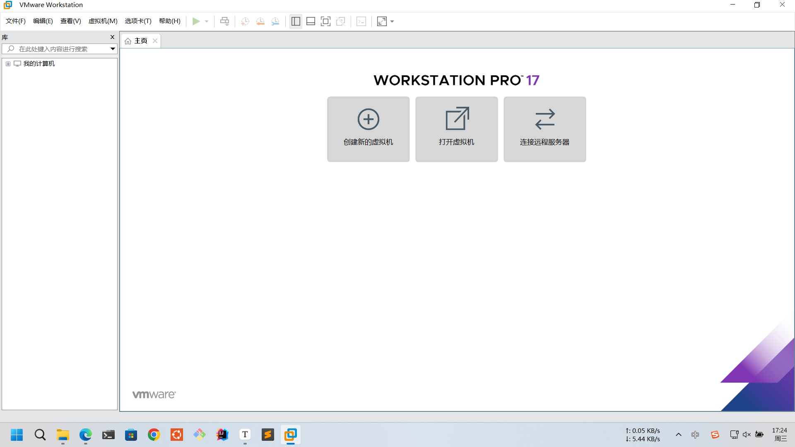

2. 选择典型向导，并点击`下一步`

   

3. 选择稍后安装操作系统，并点击`下一步`

   

4. 选择操作系统类型，分别选择`Linux`和`Centos 7 64 位`，并点击`下一步`

   

5. 为虚拟机命令并选择安装目录，完成后点击`下一步`

   

6. 设置磁盘大小，建议`40G`，完成后点击`下一步`

   

7. 点击`自定义硬件`

   

8. 自定义虚拟机内存大小，推荐`4G`

   

9. 自定义虚拟机处理器，推荐1个处理器2个核心

   

10. 自定义网络模式，暂时选择`桥接模式`

    

## 2.3 安装Centos7系统

Linux系统拥有众多的发行版，其中Centos是最常用于服务器的发行版之一，除此之外，还有Ubuntu、Debian等等。

> Linux发行版是指在相同的Linux内核的基础上，增加不同的系统工具和应用程序等，从而构成的一个完整的操作系统。

1. 下载Centos系统镜像

   IOS镜像的下载地址为：

   - 官网：https://www.centos.org/download/

   - 国内镜像：http://mirrors.aliyun.com/centos/7/isos/x86_64/

2. 安装系统镜像，选择`CD/DVD`模式

   

3. 选择ISO镜像，并指定`CentOS-7-x86_64-DVD-2009.iso`镜像所在路径，完成后点击`确定`

   

4. 开启虚拟机，开始安装系统

   

5. 鼠标点击虚拟机屏幕，进入虚拟机（如需返回主机系统，同时按住`Ctrl`和`Alt`键），使用上下前切换安装选项，选中第一项`Install Centos 7`（白色为选中），然后点击回车键。

   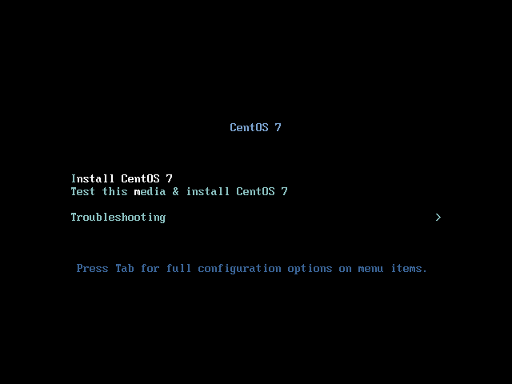

6. 等待启动安装向导

   

7. 向导启动成功后，界面如下图所示

   

8. 选择系统语言，推荐`中文`，完成后点击`继续`

   

9. 选择系统时区，要求选择`亚洲/上海`。

   

10. 选择预置软件，推荐选择`Gnome`

   

11. 选择系统安装位置，推荐使用自动配置分区

    

12. 关闭KDUMP，已节省资源

    

13. 上述内容设置完毕后，点击开始安装

    

14. 设置root用户密码

    

15. 创建普通用户

    

16. 等待系统安装完成

    

17. 安装完成后，重启系统

    

18. 重启后，同意许可协议

    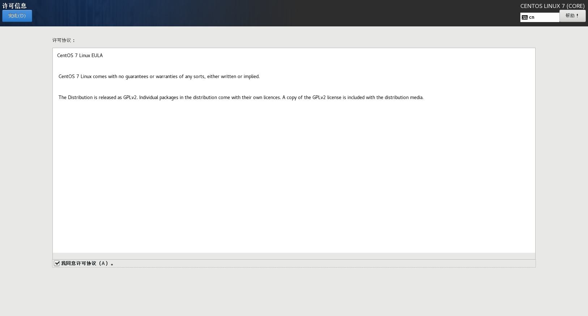

19. 连接网络

    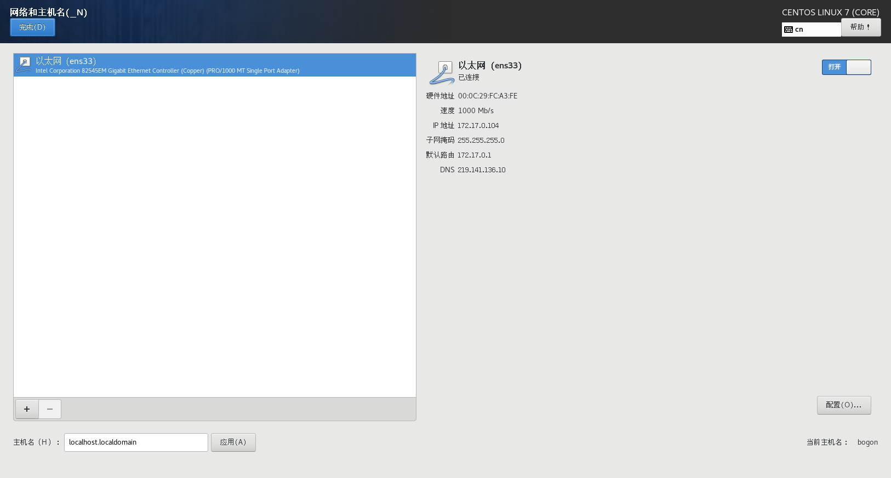

    **注意：**

    若网络连接不成功，可按照以下步骤解决。

    - 检查主机是否联网，因为桥接模式下，虚拟机直接连接到主机所连接的网络。

    - 配置虚拟网络编辑器

      - 打开虚拟网络编辑器

        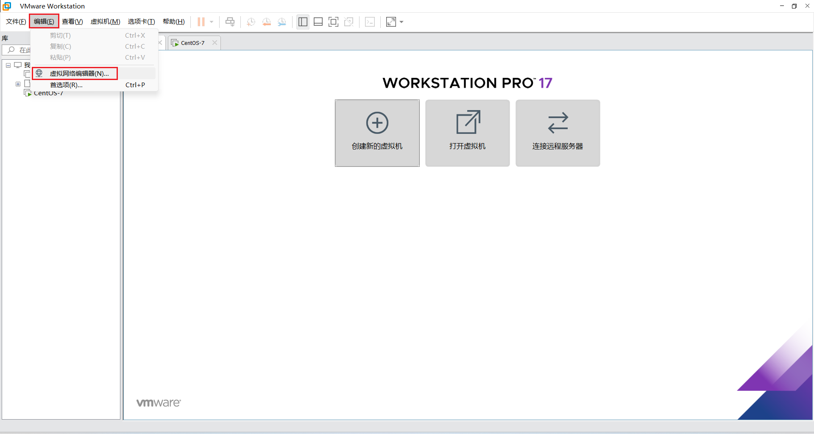

      - 点击`更改设置`

        

      - 修改桥接模式网络配置，将虚拟机桥接到主机联网所使用的网卡。

        

20. 完成后，点击`完成配置`

    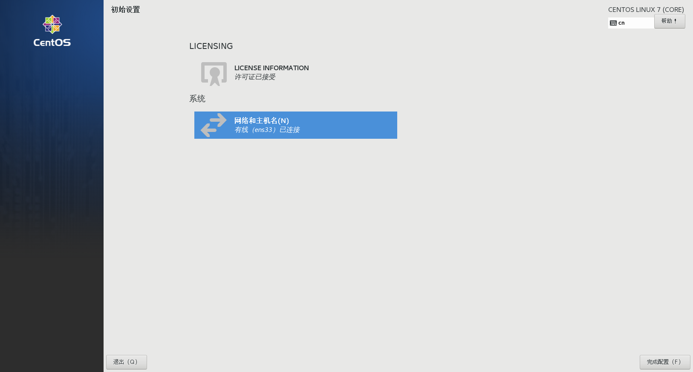

## 2.4 VMware使用技巧

### 2.4.1 系统快照

所谓系统快照，就是将操作系统的当前状态保存下来，若将来系统出现不可修复的故障，便可使用快照恢复操作系统。下面演示VMware提供的快照功能。

1. **拍摄快照**

   找到需要拍摄的虚拟机，执行如下操作

   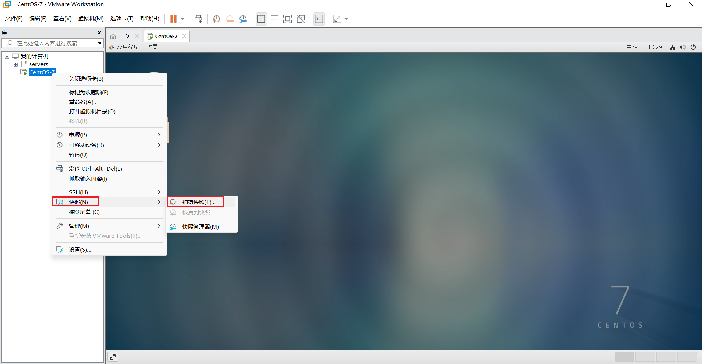

   填写快照信息

   

2. **误操作**

   假如失误删除了系统的一些重要文件，导致系统无法正常运行，例如下图所示

   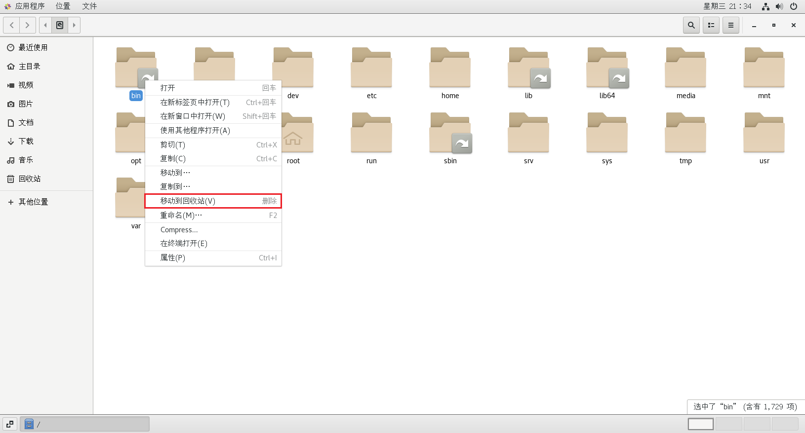

   关机后再启动，发现无法进入系统。

3. **恢复快照**

   进入快照管理器

   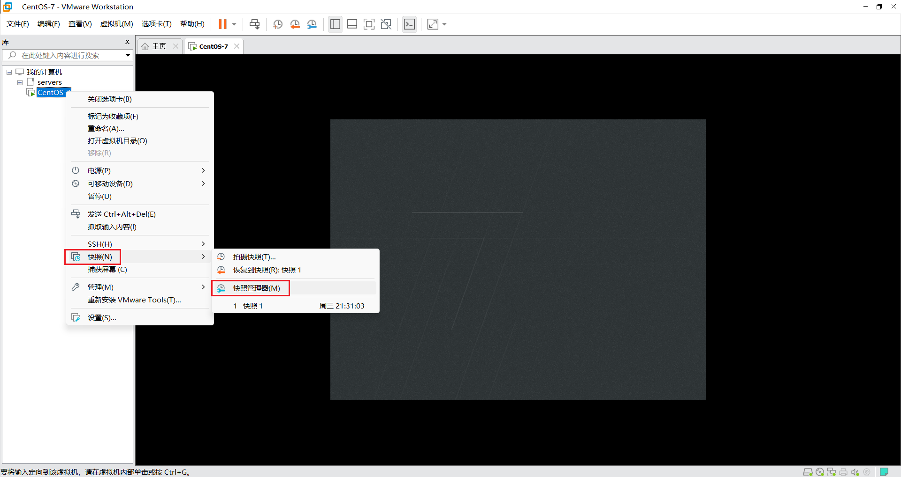

   选中要恢复的快照，点击`转到`，即可将系统恢复到指定的状态。

   

4. **删除快照**

   若快照已经十分久远，失去其存在的意义，便可将其删除，具体操作如下图所示

   

### 2.4.2 克隆虚拟机

顾名思义，克隆虚拟机就是将现有的虚拟机复制一份，得到一台和原有虚拟机配置完全相同的虚拟机，从而省去重复安装系统的繁琐工作。克隆虚拟机的具体操作如下

1. 将需要克隆的虚拟机关机

2. 选中要克隆的虚拟机，并打开克隆向导

   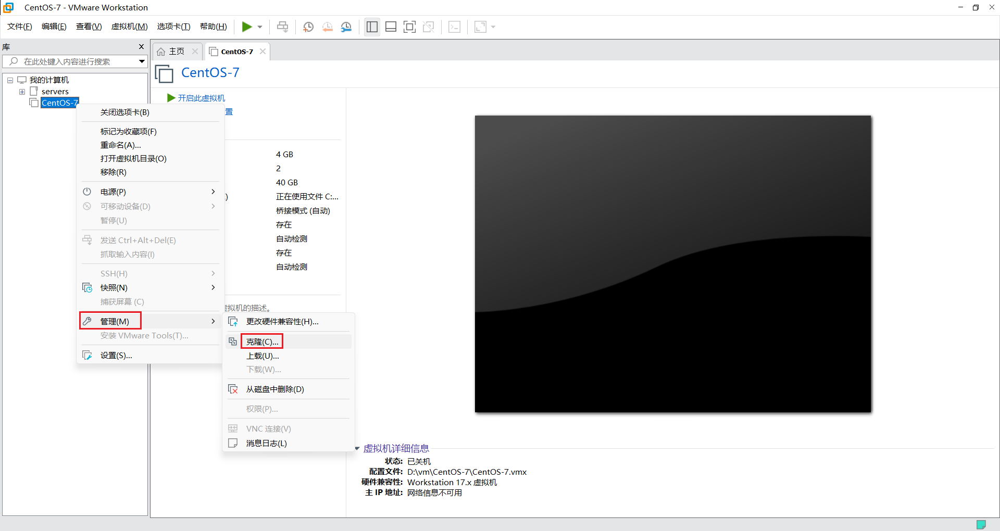

3. 选择克隆状态，可选最新状态或者快照中的历史状态

   

4. 选择克隆方式，推荐选择`完整克隆`

   

5. 填写新虚拟机的名称和安装目录，最后点击完成

   


### 2.4.3 删除虚拟机

废弃不用的虚拟机可通过如下方式删除

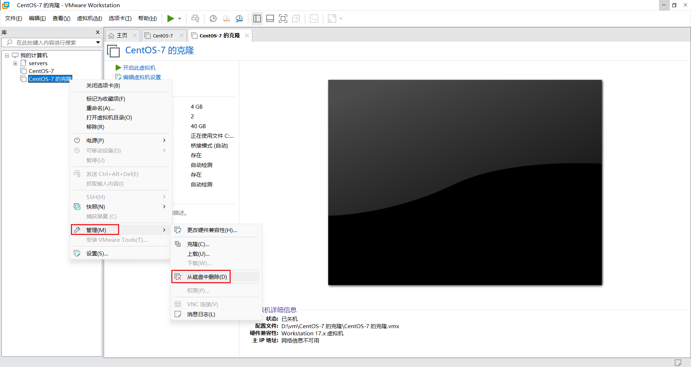

# 3. Linux文件系统目录结构

理解和熟悉Linux系统的文件系统目录结构，对于有效的管理和定位文件十分重要。Linux文件系统的目录结构如下图所示：


其中各目录的作用如下表所示

| 目录  | 说明                                    | 作用                                                         |
| ----- | --------------------------------------- | ------------------------------------------------------------ |
| /     | 根目录                                  | 根目录是整个文件系统的起点，所有其他目录和文件都位于根目录之下。 |
| /home | 家目录                                  | 每个用户的个人目录都位于这个目录下，通常以用户名命名。例如，用户`john`的主目录路径为`/home/john`。 |
| /root | root用户的家目录                        | 保存root用户的个人数据                                       |
| /boot | 引导文件所在目录                        | 保存系统启动时所需的各种文件                                 |
| /usr  | User System Resources的简写，说法不唯一 | 存放用户可用的软件和程序文件，也包括了一些共享的数据和库文件。 |
| /bin  | binary的简写                            | 存放系统的基本命令（如ls、cp等）和其余可执行文件。           |
| /sbin | system binary的简写                     | 存放系统管理和维护方面的二进制文件。                         |
| /etc  | etcetera的简写                          | 存放系统的配置文件，包括各种程序的配置文件和系统的全局配置文件。 |
| /var  | variable的简写                          | 存放系统运行时产生的可变数据，如日志文件、数据库文件等。     |
| /opt  | optional的简写                          | 存放一些可选的软件包，通常由用户自行安装。                   |
| /tmp  | temporary的简写                         | 存放临时文件，系统会定期清理该目录                           |

# 4. Linux交互界面

服务器中Linux系统，通常不会安装图形用户界面（GUI，Graphical User Interface），因此我们与操作系统的交互主要靠命令行界面（CLI，Command Line Interface），如下图所示


在命令行界面，用户通过输入一些列命令来和操作系统进行交互，例如通过`mkdir /test`来创建`/test`目录。这些命令通常由shell解释并执行。


# 5. Linux常用命令

## 5.1 文件和目录相关

1. **pwd（print working directory）**

   - **作用**

     打印当前目录的绝对路径

   * **基本语法**

     `pwd`


   * **案例实操**

     显示当前工作目录的绝对路径

     ```纯文本
     [root@localhost ~]# pwd
     /root
     ```


2. **ls（list）**

   - **作用**

     列出目录内容

   * **基本语法**

     `ls [选项] [目录或是文件]`


   * **选项说明**

     | 选项 | 功能                                                         |
     | ---- | ------------------------------------------------------------ |
     | -a   | 全部的文件，连同隐藏文件( 开头为 . 的文件) 一起列出来        |
     | -l   | 使用较长（详细）的格式列出信息，包含文件的属性与权限等等数据 |


   * **实操案例**

     查看当前目录的所有内容信息

     ```纯文本
     [atguigu@localhost ~]$ ls -al
     总用量 44
     drwx------. 5 atguigu atguigu 4096 5月  27 15:15 .
     drwxr-xr-x. 3 root    root    4096 5月  27 14:03 ..
     drwxrwxrwx. 2 root    root    4096 5月  27 14:14 hello
     -rwxrw-r--. 1 atguigu atguigu   34 5月  27 14:20 test.txt
     ```

   * **显示说明**

     每行列出的信息依次是： 文件类型与权限 链接数 文件属主 文件属组 文件大小 最近修改时间 文件名


3. **cd（change directory）**

   - **作用**

     切换路径

   * **基本语法**

     `cd [参数]`


   * **参数说明**

     | 参数        | 功能                     |
     | ----------- | ------------------------ |
     | cd 绝对路径 | **切换路径**             |
     | cd 相对路径 | **切换路径**             |
     | cd ~或者cd  | 回到自己的家目录         |
     | cd -        | 回到上一次所在目录       |
     | cd ..       | 回到当前目录的上一级目录 |


4. **mkdir（Make Directory） **

   - **作用**

     创建目录

   * **基本语法**

     `mkdir [选项] 要创建的目录`


   * **选项说明**

     | 选项 | 功能         |
     | ---- | ------------ |
     | -p   | 创建多层目录 |


   * **实操案例**

     *   创建一个目录

     ```text
     [root@localhost ~]# mkdir hello
     
     [root@localhost ~]# mkdir hello/world
     ```

     *   创建一个多级目录

     ```text
     [root@localhost ~]# mkdir -p big/world
     ```


5. **cp（copy）**

   - **作用**

     复制文件或目录

   * **基本语法**

     `cp [选项] source dest`


   * **选项说明**

     | 选项 | 功能               |
     | ---- | ------------------ |
     | -r   | 递归复制整个文件夹 |


   * **参数说明**

     | 参数   | 功能     |
     | ------ | -------- |
     | source | 源文件   |
     | dest   | 目标文件 |


   * 实操案例

     *   复制文件

     ```text
     [root@localhost ~]# cp ./initial-setup-ks.cfg ./hello
     ```

     *   递归复制整个文件夹

     ```text
     [root@localhost ~]# cp -r ./big ./hello
     ```


6. **rm（remove）**

   - **作用**

     移除文件或者目录

   * **基本语法**

     `rm [选项] deleteFile`


   * **选项说明**

     | 选项 | 功能                        |
     | ---- | --------------------------- |
     | -r   | 递归删除目录所有内容        |
     | -f   | 强制删除,不提示用户进行确认 |


   * **实操案例**

     *   递归删除目录中所有内容

     ```text
     [root@localhost ~]# rm -rf ./big
     ```


7. **mv（move）**

   - **作用**

     移动或重命名文件

   * **基本语法**

     - 移动文件

       ```纯文本
       mv 源文件 目标目录
       ```

     * 重命名

       ```
       mv 源文件 目标文件
       ```
     
   * **案例实操**
   
      * 移动文件
   
        ```纯文本
        [root@localhost ~]# cd hello/
        [root@localhost hello]# mv initial-setup-ks.cfg world/
        ```
        
      * 移动文件并重命名
   
        ```
        [root@localhost world]# mv initial-setup-ks.cfg ../hello.cfg
        ```
        
       * 重命名
   
         ```
         [root@localhost hello]# mv hello.cfg initial-setup-ks.cfg
         ```
   


8. **cat**

   - **作用**

     查看文件内容

   * **基本语法**

     `cat  [选项] 文件`


   * **选项说明**

     | 选项 | 功能描述                  |
     | ---- | ------------------------- |
     | - n  | 显示所有行的行号,包括空行 |


   * **实操案例**

     查看文件内容并显示行号

     ```纯文本
     [atguigu@localhost ~]$ cat -n hello.cfg
     ```


9. **tail** 

   - **作用**

     输出文件尾部内容

   *   **基本语法**
       - `tail 文件`（功能描述：查看文件后10行内容）
       - `tail -n 5 文件`（功能描述：查看文件后5行内容，5可以是任意行数）
       - `tail -f 文件`（功能描述：实时追踪该文档的所有更新）


   * **选项说明**

     | 选项     | 功能                                 |
     | -------- | ------------------------------------ |
     | -n<行数> | 输出文件尾部n行内容                  |
     | -f       | 显示文件最新追加的内容，监视文件变化 |


   * **实操案例**

     *   查看文件最后50行内容

     ```纯文本
     [root@localhost ~]# tail -n 50 helle.cfg
     ```

     *   实时追踪该档的所有更新

     ```纯文本
     [root@localhost ~]# tail -f hello.cfg
     ```

## 5.2 文本编辑相关


在命令行界面下，最常用的文本编辑器就是**Vi/Vim**。其中**Vi** 是 Linux操作系统中最通用的文本编辑器。 **Vim**编辑器是**Vi**的增强版，相较于**Vi**，提供了代码高亮等功能。两者用法完全兼容。下面介绍**Vim**的用法。

- **基础语法**

  `vim 文件` 

- **Vim模式介绍**

  Vim文编辑器有不同的工作模式，在不同模式下，可执行不同的操作，主要模式有

  - **普通模式（Normal Mode）**：用于删除、复制、粘贴等基本操作。
  - **编辑模式（Insert Mode）**：用于编辑文本。
  - **命令行模式（Command Mode）**：用于执行命令，如保存、退出等。

  下图为各模式之间的切换方法

  

下面分别介绍各模式下的用法

- **编辑模式**

  编辑模式下，可进行正常的编辑操作，可在编辑模式下和其他模式下灵活切换，提高编辑效率。

- **一般模式**

  在这个模式中， 可以使用上下左右按键来移动光标，也开通过一些简单的操作来复制粘贴以及删除文本，具体操作如下

  - 光标操作

    | 快捷键       | 操作       |
    | ------------ | ---------- |
    | `shift+6(^)` | 移动到行头 |
    | `shift+4($)` | 移动到行尾 |
    | `shift+g`    | 移动到页尾 |
    | `gg`         | 移动到页头 |

  - 复制粘贴操作

    | 快捷键 | 操作           |
    | ------ | -------------- |
    | `yy`   | 复制光标当前行 |
    | `yw`   | 复制光标当前词 |
    | `p`    | 粘贴           |

  - 删除操作

    | 快捷键  | 操作                            |
    | ------- | ------------------------------- |
    | `dd`    | 删除光标当前行                  |
    | `d n d` | 删除当前光标所处行及其以下共n行 |
    | `x`     | 删除当前光标处的一个字符        |

- **命令模式**

  命令模式下可通过一些命令实现存盘、退出、显示行号、搜索、批量替换等功能，具体命令如下

  | 命令           | 操作                                                   |
  | -------------- | ------------------------------------------------------ |
  | `:w`           | 保存                                                   |
  | `:q`           | 退出                                                   |
  | `:!`           | 强制执行                                               |
  | `:set nu`      | 显示行号                                               |
  | `:set nonu`    | 取消行号                                               |
  | `/文本`        | 搜索文本，输入n：光标指向下一个，输入N：贯标指向上一个 |
  | `:nohl`        | 搜索文本后，匹配内容会高亮显示，该命令可取消高亮       |
  | `:s/old/new/g` | 在全局范围内使用new替换old内容                         |


## 5.3 文件权限相关

### 5.3.1 文件权限概述

Linux中的所有文件均有严格的访问权限控制，只有当用户拥有某个文件的相关权限时，才可对文件执行相关操作。

**权限系统相关概念**

- **用户和用户组**

  在Linux系统中注册的个体称为一个**用户**，例如root和atguigu，除此之外还能使用`useradd <用户名>`命令创建新的用户。每个用户都可以属于一个或多个**用户组**，可以使用`groups <用户名>`命令查看用户所属的组，使用`usermod -g <新组名> <用户名>`修改用户所属组。

  每个文件或者目录都有一个所属用户和一个所属组。

- **文件权限**

  在Linux中，文件和目录的权限主要分为三个部分：读（read）、写（write）和执行（execute）。

  - **读权限**，表示可以读取文件的内容或者查看目录的内容。
  - **写权限**，表示可以修改文件内容或者在目录中创建、删除文件。
  - **执行权限**，表示可以运行可执行文件或者进入目录。

- **权限字符串**：

  在Linux系统中，文件和目录的权限用一组字符来表示，通常以`rwxr-xr--`的形式呈现，其中`r`、`w`、`x`分别表示读、写和执行权限。以下是权限字符的含义：

  *   第1-3位确定属主（该文件的所有者）拥有该文件的权限。

  *   第4-6位确定属组（所有者的同组用户）拥有该文件的权限。

  *   第7-9位确定其他用户拥有该文件的权限。


**思考题**

若某文件的权限字符串为`rwxr-xr--`，请分析该文件的权限策略。

### 5.3.2 常用命令

1. **chmod（change mode）**

   - **作用**

     修改文件或目录权限

   - **基本语法**

     - `chmod [选项] [u/g/o/a][+/-/=][r/w/x] 文件或目录`
       
       - u：user
       - g：group
       - o：other
       - a：all
       
     - `chmod [选项] 777 文件或目录`
     
       | 权限表示法     | user | group | other |
       | -------------- | ---- | ----- | ----- |
       | 字符串         | rwx  | r-x   | rw-   |
       | 数字（二进制） | 111  | 101   | 110   |
       | 数字（八进制） | 7    | 5     | 6     |
       
   
   - **选项说明**
   
      | 选项 | 功能     |
      | ---- | -------- |
      | -R   | 递归操作 |
      
   
     - **实操案例**
   
       *   修改文件使其所属主用户具有执行权限
   
       ```纯文本
       [root@localhost ~]# chmod u+x hello.cfg
       ```
   
       *   修改文件使其所属组用户具有执行权限
   
       ```纯文本
       [root@localhost ~]# chmod g+x hello.cfg
       ```
   
       *   修改文件所属主用户执行权限,并使其他用户具有执行权限
   
       ```纯文本
       [root@localhost ~]# chmod u-x,o+x hello.cfg
       ```
   
       *   采用数字的方式，设置文件所有者、所属组、其他用户都具有可读可写可执行权限。
   
       ```纯文本
       [root@localhost ~]# chmod 777 hello.txt
       ```
   
       *   修改整个文件夹里面的所有文件的所有者、所属组、其他用户都具有可读写执行权限。
   
       ```纯文本
       [root@localhost ~]# chmod -R 777 hello/
       ```
   
2. **chown（change owner）**

   - **作用**

     改变文件或目录所有者

   * **基本语法**

     `chown [选项] 用户[:用户组] 文件或目录`
   
   
      * **选项说明**
   
        | 选项 | 功能     |
        | ---- | -------- |
        | -R   | 递归操作 |
   
   
      * **实操案例**
   
        *   修改文件所有者
   
        ```纯文本
        [root@localhost ~]# chown atguigu helle.cfg 
        ```
   
        *   递归改变文件所有者和所有组
   
        ```纯文本
        [root@localhost ~]# chown -R atguigu:atguigu hello/
        ```
   

## 5.4 进程管理相关

操作系统中正在运行的一个程序称为一个进程。

- **查看进程**

  可以使用`ps`（process status）命令查看操作系统中当前的进程。

  - **常见用法**

    - **`ps aux`**

      选项说明如下

      | 选项 | 功能                         |
      | ---- | ---------------------------- |
      | a    | 显示所有前台进程             |
      | u    | 以用户友好的方式打印进程信息 |
      | x    | 显示后台进程                 |

      `ps aux`显示内容如下

      ```
      USER        PID %CPU %MEM    VSZ   RSS TTY      STAT START   TIME COMMAND
      root          1  0.0  0.1 193964  7048 ?        Ss   08:56   0:01 /usr/lib/systemd/systemd
      root          2  0.0  0.0      0     0 ?        S    08:56   0:00 [kthreadd]
      root          4  0.0  0.0      0     0 ?        S<   08:56   0:00 [kworker/0:0H]
      root          5  0.0  0.0      0     0 ?        S    08:56   0:00 [kworker/u256:0]
      ```

      注：

      - **USER**：启动该进程的用户
      - **PID**：进程ID
      - **%CPU**：该进程占用CPU资源的百分比
      - **%MEM**：该进程占用物理内存的百分比
      - **COMMAND**：产生此进程的命令名

    - **`ps -ef`**

      选项说明如下

      | 选项 | 功能                           |
      | ---- | ------------------------------ |
      | -e   | 显示所有进程                   |
      | -f   | 以完整的格式显示进程的详细信息 |

      `ps -ef`显示内容如下

      ```
      UID         PID   PPID  C STIME TTY          TIME CMD
      root          1      0  0 08:56 ?        00:00:01 /usr/lib/systemd/systemd 
      root          2      0  0 08:56 ?        00:00:00 [kthreadd]
      root          4      2  0 08:56 ?        00:00:00 [kworker/0:0H]
      root          5      2  0 08:56 ?        00:00:00 [kworker/u256:0]
      root          6      2  0 08:56 ?        00:00:00 [ksoftirqd/0]
      root          7      2  0 08:56 ?        00:00:00 [migration/0]
      ```

      注：

      - **UID**：用户ID 
      - **PID**：进程ID 
      - **PPID**：父进程ID 
      - **CMD**：启动进程所用的命令和参数

  - **使用技巧**

    日常查看进程时，通常会将上述命令与`grep`命令配合使用，`grep`可用于过滤文本行。

    例如想查看所有的Java进程，便可执行以下命令

    ```bash
    ps -ef | grep java
    ```

    `|`符号称为管道符，其作用是将前边命令的输出作为下一命令的输入。

- **终止进程**

  若想停止进程，可使用`kill`命令，其用法如下

  - 基本语法

    `kill [选项] 进程号`

  - 选项说明

    | 选项 | 功能                 |
    | ---- | -------------------- |
    | -9   | 表示强迫进程立即停止 |

  - 案例实操，启动火狐浏览器，并杀死相关进程。

    提示：火狐浏览器的英文名称为firefox。

## 5.6 压缩归档相关

1. **zip/unzip**

   `zip/unzip`可用于压缩和解压缩zip文件，使用方式如下

   - **基本语法**

     `zip [选项] XXX.zip 文件或路径` 
     `unzip [选项] XXX.zip   ` 

   - **选项说明**

     | zip选项 | 功能     |
     | ------- | -------- |
     | -r      | 压缩目录 |

     | unzip选项 | 功能                     |
     | --------- | ------------------------ |
     | -d 目录   | 指定解压后文件的存放目录 |

   - **案例实操**

     - 压缩文件

       创建两个文件`file1.txt`和`file2.txt`，并将其压缩为`first.zip`

       ```
       [root@localhost ~]# vim file1.txt
       [root@localhost ~]# vim file2.txt
       
       [root@localhost ~]# zip first.zip file1.txt file2.txt
       ```

     - 压缩目录

       ```
       [root@lcoalhost ~]# zip -r hello.zip hello
       ```

     - 解压

       创建一个`zip`目录，并将`first.zip`中的内容解压到`zip`目录

       ```
       [root@lcoalhost ~]# mkdir zip
       [root@lcoalhost ~]# unzip first.zip -d zip/
       ```

2. **tar**

   `tar`可用于对文件进行归档（打包）和压缩，使用方式如下

   - **基本语法**

     打包：`tar [选项] -c -f 包名 文件1 文件2 文件3 ...`

     解包：`tar [选项] -x -f 包名 -C 指定目录 `

   - **选项说明**

     | 选项    | 功能                                     |      |
     | ------- | ---------------------------------------- | ---- |
     | -c      | 打包                                     |      |
     | -x      | 解包                                     |      |
     | -z      | 打包的同时进行压缩（解包的时候进行解压） |      |
     | -v      | 打包或解包时显示正在处理的文件信息       |      |
     | -f 包名 | 指定打包后的文件名后者要解包的文件名     |      |
     | -C 目录 | 解包到指定目录                           |      |

   - **案例实操**

     - 打包`file1.txt`和`file2.txt`到`first.tar`

       ```
       [root@lcoalhost ~]# tar -cvf first.tar file1.txt file2.txt
       ```

     - 打包并压缩`file1.txt`和`file2.txt`到`first.tar.gz`

       ```
       [root@lcoalhost ~]# tar -zcvf first.tar.gz file1.txt file2.txt
       ```

     - 解包并解压`first.tar.gz`到`tar`目录

       ```
       [root@lcoalhost ~]# mkdir tar
       [root@lcoalhost ~]# tar -zxvf first.tar.gz -C ./tar
       ```

## 5.7 安装应用相关

### 5.7.1 **RPM离线安装**

1. **RPM概述**

   RPM（RedHat Package Manager），RedHat软件包管理工具，在基于 RedHat 的 Linux 发行版中广泛使用。常见软件包如下`Apache-1.3.23-11.i386.rpm`，类似于Windows系统中的`exe`文件。

2. **rpm命令**

   可以使用`rpm`命令安装、卸载和查看系统中的应用，具体用法如下

   - **安装**

     - 基本语法

       `rpm -ivh 软件包路径`

     - 选项说明

       | 选项 | 功能                     |
       | ---- | ------------------------ |
       | -i   | -i=install，安装         |
       | -v   | -v=verbose，显示详细信息 |
       | -h   | -h=hash，进度条          |

     - 案例实操

       在以下地址下载一个***sl软件***的rpm安装包，并安装

       下载地址：https://dl.fedoraproject.org/pub/epel/7/x86_64/Packages/s/sl-5.02-1.el7.x86_64.rpm

   - **查看**

     - 基本语法

       `rpm -qa`（功能描述：查询所安装的所有rpm软件包）

     - 选项说明

       | 选项 | 功能     |
       | ---- | -------- |
       | -q   | 查询模式 |
       | -a   | 表示所有 |

     - 案例实操

       查询刚刚安装的软件

       ```
       [root@localhost ~]# rpm -qa | grep sl
       ```

   - **卸载**

     - 基本语法

       `rpm -e 软件包名 `

     - 案例实操

       卸载刚刚安装的sl软件

       ```
       [root@localhost ~]# rpm -e sl-5.02-1.el7.x86_64
       ```

### 5.7.2 **Yum在线安装**

1. **Yum概述**

   YUM（全称为 Yellowdog Updater Modified）是一个Linux软件包管理器。基于RPM包管理，能够从指定的服务器自动下载RPM包并且安装，并且可以**自动处理依赖关系**，并且一次安装所有依赖的软件包，无须繁琐地一次次下载、安装，该功能类似在JAVA中使用Maven工具从远程仓库中下载依赖一样,可以自动处理依赖关系。

2. **yum命令**

   可以使用yum安装和卸载应用，具体用法如下

   - **安装软件包**

     - 基本语法

       `yum [选项] install 软件包名`

     - 选项说明

       | 选项 | 功能                  |
       | ---- | --------------------- |
       | -y   | 对所有提问都回答“yes” |

     - 案例实操

       使用yum在线安装***sl***软件

       - 查询sl软件的包名

         可在如下网站搜索Linux中的各种软件包，地址为https://pkgs.org/，搜索sl，并查看对应的Linux发行版，搜索结果为`yum install sl`。

       - 执行yum安装命令

         执行`yum install sl`后的结果为

         ```
         没有可用软件包 sl。
         错误：无须任何处理
         ```

         原因分析，yum的工作原理是从我们所配置的远程仓库下载rpm包，然后进行安装，远程仓库的配置文件位于`/etc/yum.repo.d/`目录中。上述问题的原因就是sl软件的rpm包不在系统预先配置的这些远程仓库中。因此需要先配置sl所在的远程仓库，才可使用yum进行安装，具体操作如下。

       - 配置远程仓库

         远程仓库可手动配置，也可在线配置，下面在线配置

         ```undefined
         [root@localhost ~]# yum -y install epel-release 
         ```

         完成后观察`/etc/yum.repo.d/`目录下配置文件的变化。

       - 重新安装sl

         ```
         [root@localhost ~]# yum -y install sl
         ```
   
   - **卸载软件包**
   
     - 基本语法
   
       `yum remove 软件包名`
   
   - **案例实操**
   
     卸载sl软件
   
     ```
     [root@localhost ~]# yum remove sl
     ```

# 6. Linux系统远程访问

多数情况下，工作时所用的服务器并不在身边，这些计算机要么位于机房，要么位于云端，因此我们不能向操作个人电脑一样操作服务器，而是需要通过远程登录的方式来操作。

## 6.1 SSH概述

SSH（Secure Shell）使用一种网络协议，用于在计算机之间建立加密的连接，从而允许用户以安全的方式在远程的计算机中执行命令。


## 6.2 SSH实操

Linux系统中都会预装SSH服务，因此我们只需在自己的个人电脑安装SSH客户端，然后配置连接即可。可以选择的SSH客户端有很多，目前，比较主流的有 Xshell, SecureCRT，FinalShell，MobaXterm 等，同学们可以根据自己的习惯自行选择。本课程使用MobaXterm，下面演示具体使用方式。

1. 在Windows主机安装MobaXterm软件，安装包位于项目资料中。

2. 查询虚拟机IP地址

   使用`ifconfig`（network interfaces configuring）命令可查看虚拟机ip地址，其输出内容如下

   ```
   ens33: flags=4163<UP,BROADCAST,RUNNING,MULTICAST>  mtu 1500
           inet 172.17.0.104  netmask 255.255.255.0  broadcast 172.17.0.255
           inet6 fe80::5fdd:f01e:a4fb:966  prefixlen 64  scopeid 0x20<link>
           ether 00:0c:29:fc:a3:fe  txqueuelen 1000  (Ethernet)
           RX packets 183030  bytes 70503744 (67.2 MiB)
           RX errors 0  dropped 78  overruns 0  frame 0
           TX packets 23385  bytes 1917128 (1.8 MiB)
           TX errors 0  dropped 0 overruns 0  carrier 0  collisions 0
   
   lo: flags=73<UP,LOOPBACK,RUNNING>  mtu 65536
           inet 127.0.0.1  netmask 255.0.0.0
           inet6 ::1  prefixlen 128  scopeid 0x10<host>
           loop  txqueuelen 1000  (Local Loopback)
           RX packets 0  bytes 0 (0.0 B)
           RX errors 0  dropped 0  overruns 0  frame 0
           TX packets 0  bytes 0 (0.0 B)
           TX errors 0  dropped 0 overruns 0  carrier 0  collisions 0
   
   virbr0: flags=4099<UP,BROADCAST,MULTICAST>  mtu 1500
           inet 192.168.122.1  netmask 255.255.255.0  broadcast 192.168.122.255
           ether 52:54:00:ea:8a:fb  txqueuelen 1000  (Ethernet)
           RX packets 0  bytes 0 (0.0 B)
           RX errors 0  dropped 0  overruns 0  frame 0
           TX packets 0  bytes 0 (0.0 B)
           TX errors 0  dropped 0 overruns 0  carrier 0  collisions 0
   ```

   其中`ens33`，为虚拟机的以太网络接口，此处获取的ip地址为`172.17.0.104`。

3. 在MobaXterm中配置SSH（Secure Shell）连接

   - 点击Session选项

     

   - 点击SSH选项，并配置连接信息

     

   - 输入root用户密码

     

   - 远程登录成功，如下图所示

     

# 7. 虚拟机网络配置

## 7.1 目前痛点

目前虚拟机联网方式为桥接模式，这种模式下，虚拟机通过主机的物理网卡，直接连接到主机所在的网络当中。具体效果如下图所示。


这种模式下存在两个痛点

1. 主机必须连接到某个网络中，主机和虚拟机才能互通。
2. 更换网络后，主机和虚拟机的IP地址均会发生变化，因此远程访问工具中的IP需要同步进行修改。

为解决上述痛点，我们需要调整虚拟机的网络模式和配置静态IP。

## 7.2 虚拟机网络模式

### 7.2.1 主机网络环境

为理解VMware中的虚拟网络模式，我们首先需要明确主机所处的真实网络环境，其所处环境如下图所示：


如上图所示，路由器一端（WAN口，Wide Area Network）连接互联网，另一端（Local Area Network，LAN）连接多个设备，这些设备组成一个局域网，局域网中的设备都通过路由器访问互联网，这个场景应该是大家十分熟悉的。下面为大家介绍路由器中的两个十分重要的角色。

- **DHCP**

  全称**Dynamic Host Configuration Protocol** ，动态主机配置协议，该协议用于给联网的设备自动分配（私网）IP地址和其他网络配置。家用路由器中一般就会集成DHCP服务，因此设备只要连接上路由器，便能自动获取IP地址等网络配置。

- **NAT**

  全称**Network Address Translation**，网络地址转换，该技术主要用于缓解IPv4地址短缺，有了NAT之后，可以令多个网络设备共享一个公网IP地址，家庭路由器中也都集成了该服务。

  其工作原理是，NAT设备（路由器）一端连接互联网，其具有一个公网IP，另一端连接一个局域网，局域网中的每个设备均只有一个私网IP。当局域网中的设备经过路由器向互联网中的其他设备发送数据时，NAT服务会将数据包的源地址由该设备的私网IP替换为路由器的公网IP，因此互联网中的其他设备看到源地址为路由器的公网IP，所以其返回数据时，就会把路由器的公网IP设置为目标地址，路由器接收到数据之后，NAT设备再将数据的目标地址由路由器的公网IP改为原设备的私网IP，最终数据就能返回到该设备了。具体流程如下图所示

  

在对我们的主机所处的网络环境有了一个了解后，下面分别为大家介绍VMware中的三种网络模式。

### 7.2.2 桥接模式

桥接模式的原理如下图所示


这种模式下，VMware虚拟出了一个交换机。首先，该虚拟交换机通过主机的物理网卡连接到主机所在的网络中，然后所有的虚拟机都通过虚拟交换机接入到主机所在网络中。所以在该模式下，虚拟机和主机位于同一网络中，因此在主机接入网络的前提下，虚拟机和物理机是可以互通的。

### 7.2.3 NAT模式

NAT模式的原理如下图所示


这种模式下，VMware虚拟出了一个交换机，一个DHCP服务以及一个NAT服务，相当于构成了一个虚拟路由器。虚拟路由器通过主机的物理网卡连接到主机所在的网络，虚拟机则全部连接到虚拟路由器上，组成了一个子网。此时所有的虚拟机位于同一网络，因此彼此之间可以互通，但是主机不能与虚拟机互通。

为使主机能够和虚拟机互通，VMware又在主机中虚拟出了一个网卡，并连接到了这个虚拟路由器中，这时主机便可虚拟机互通了。

### 7.2.4 仅主机模式

仅主机模式的原理如下图所示


这种模式，和NAT模式十分相似，唯一的区别是，虚拟路由器并未连接到主机所在的网络中，因此主机和虚拟机之间可以互通，但是虚拟机不能访问互联网。

### 7.2.5 网络模式选择

为保证主机未联网的情况下，主机和虚拟机也能实现互通；同时保证主机联网的情况下虚拟机也能访问互联网，我们最好选择上述三种模式中的NAT模式，具体配置如下。

#### 7.2.5.1 VMware虚拟网络配置

1. 点击VMware菜单栏中的`编辑`，选择`虚拟网络编辑器`

   

2. 打开虚拟网络编辑器后，赋予管理员权限

   

3. 配置VMnet8子网

   

4. 打开NAT配置界面

   

5. 修改NAT配置

   

   **注意事项**

   NAT网关IP须位于VMnet8子网IP范围内。

#### 7.2.5.3 虚拟机选择网络模式

1. 修改虚拟机所使用的网络模式

   

2. 选择NAT模式

   

#### 7.2.5.2 Windows主机网络配置

上述配置中，VMware已将Windows主机连接到虚拟网络中了，此处只需查看Windows主机中的虚拟网络网卡配置是否正确即可。

1. 打开网络适配器配置面板

   `Win+R`打开运行窗口，输入`ncpa.cpl`，然后按回车键

2. 查看VMnet8虚拟网络适配器

   

3. 查看IpV4配置

   

   **注意事项**

   主机IP须位于VMnet8子网IP范围内。

## 7.3 配置静态IP

NAT模式下，虚拟机的IP地址，默认情况下是由虚拟DHCP服务自动分配的，虚拟机的IP地址不固定，这对于SSH远程访问也不友好，所以通常情况下，我们不使用虚拟DHCP服务，而是手动为虚拟机配置静态的IP地址。具体操作如下。

1. 确定网络配置文件

   在终端输入如下命令`ifconfig`命令，查看当前的网络接口，内容如下

   ```
   ens33: flags=4163<UP,BROADCAST,RUNNING,MULTICAST>  mtu 1500
           inet 192.168.10.100  netmask 255.255.255.0  broadcast 192.168.10.255
           inet6 fe80::5fdd:f01e:a4fb:966  prefixlen 64  scopeid 0x20<link>
           ether 00:0c:29:fc:a3:fe  txqueuelen 1000  (Ethernet)
           RX packets 1526  bytes 136998 (133.7 KiB)
           RX errors 0  dropped 0  overruns 0  frame 0
           TX packets 1907  bytes 136735 (133.5 KiB)
           TX errors 0  dropped 0 overruns 0  carrier 0  collisions 0
   
   lo: flags=73<UP,LOOPBACK,RUNNING>  mtu 65536
           inet 127.0.0.1  netmask 255.0.0.0
           inet6 ::1  prefixlen 128  scopeid 0x10<host>
           loop  txqueuelen 1000  (Local Loopback)
           RX packets 68  bytes 5916 (5.7 KiB)
           RX errors 0  dropped 0  overruns 0  frame 0
           TX packets 68  bytes 5916 (5.7 KiB)
           TX errors 0  dropped 0 overruns 0  carrier 0  collisions 0
   
   virbr0: flags=4099<UP,BROADCAST,MULTICAST>  mtu 1500
           inet 192.168.122.1  netmask 255.255.255.0  broadcast 192.168.122.255
           ether 52:54:00:ea:8a:fb  txqueuelen 1000  (Ethernet)
           RX packets 0  bytes 0 (0.0 B)
           RX errors 0  dropped 0  overruns 0  frame 0
           TX packets 0  bytes 0 (0.0 B)
           TX errors 0  dropped 0 overruns 0  carrier 0  collisions 0
   ```

   其中ens33是目前的以太网接口，故其配置文件为`vim /etc/sysconfig/network-scripts/ifcfg-ens33`。

2. 修改网络配置文件

   打开配置文件

   ```bash
   [root@localhost ~]# vim /etc/sysconfig/network-scripts/ifcfg-ens33 
   ```

   内容如下

   ```ini
   TYPE=Ethernet
   PROXY_METHOD=none
   BROWSER_ONLY=no
   BOOTPROTO=dhcp
   DEFROUTE=yes
   IPV4_FAILURE_FATAL=no
   IPV6INIT=yes
   IPV6_AUTOCONF=yes
   IPV6_DEFROUTE=yes
   IPV6_FAILURE_FATAL=no
   IPV6_ADDR_GEN_MODE=stable-privacy
   NAME=ens33
   UUID=bf788989-e095-4e58-865a-e6b07248a514
   DEVICE=ens33
   ONBOOT=yes
   ```

   需要修改的内容如下

   - 修改`BOOTPROTO`参数为`static`

   - 修改`ONBOOT`参数为`yes`

   - 增加如下内容

     ```ini
     IPADDR=192.168.10.100
     NETMASK=255.255.255.0
     GATEWAY=192.168.10.2
     DNS1=192.168.10.2
     ```

     **注意事项**

     `IPADDR`需要位于前文VMnet8子网IP范围内，`GATEWAY`需要配置为前文的NAT服务的网管IP。

3.  重新启动网络服务

   在终端执行以下命令，重启network服务

   ```bash
   [root@localhost ~]# systemctl restart network
   ```

4. 观察网络配置是否生效

   在终端执行`ifoconfig`命令，观察`ens33`的网络接口的IP地址是否为前文所配置的`IPADDR`。
