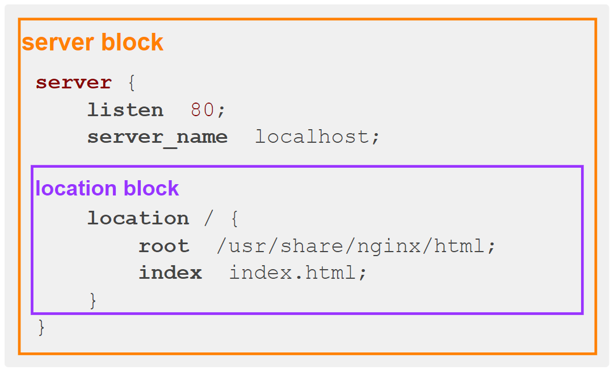

# Nginx

## Linux Centos Nginx安装

**具体内容可参考**[官方文档](https://nginx.org/en/linux_packages.html)。

1. **配置Nginx yum存储库**

   创建`/etc/yum.repos.d/nginx.repo`文件

   ```bash
   vim /etc/yum.repos.d/nginx.repo
   ```

   增加如下内容

   ```ini
   [nginx-stable]
   name=nginx stable repo
   baseurl=http://nginx.org/packages/centos/$releasever/$basearch/
   gpgcheck=1
   enabled=1
   gpgkey=https://nginx.org/keys/nginx_signing.key
   module_hotfixes=true
   
   [nginx-mainline]
   name=nginx mainline repo
   baseurl=http://nginx.org/packages/mainline/centos/$releasever/$basearch/
   gpgcheck=1
   enabled=0
   gpgkey=https://nginx.org/keys/nginx_signing.key
   module_hotfixes=true
   ```

2. **在线安装Nginx**

   执行以下命令，安装Nginx

   ```bash
   yum -y install nginx
   ```

3. **启动Nginx**

   执行以下命令启动Nginx

   ```bash
   systemctl start nginx
   ```

   执行以下命令查看Nginx运行状态

   ```bash
   systemctl status nginx
   ```

   执行以下命令设置开机自启

   ```bash
   systemctl enable nginx
   ```

4. **访问Nginx服务默认首页**

   访问`http://192.168.10.102`，能访问到如下页面，则证明Nginx运行正常。

   

### 重要的目录、文件

Nginx中有很多十分重要的目录或者文件，下面对核心内容进行介绍

1. **配置文件相关**
   - `/etc/nginx/`：主要的Nginx配置文件目录。
   - `/etc/nginx/nginx.conf`：Nginx的主配置文件，包含全局配置信息。
2. **日志相关**
   - `/var/log/nginx/`：Nginx的日志文件目录，包括访问日志和错误日志。
   - `/var/log/nginx/access.log`：访问日志，记录所有进入服务器的请求。
   - `/var/log/nginx/error.log`：错误日志，记录服务器处理过程中的错误信息。

### 配置文件概述

1. **配置文件结构**

   `nginx.conf`文件层次分明，整个文件分为多个区块（block），每个区块下可配置各种参数，也可包含其子级区块，具体结构如下图所示

   

   `nginx.conf`通过` include /etc/nginx/conf.d/*.conf`引入了`/etc/nginx/conf.d`目录下的所有`.conf`文件，该目录下的配置文件结构如下图所示

   

2. **重要配置说明**

   下面分块介绍重要的配置参数

   - **main block**

     `main block`位于配置文件的最外层，其包含了影响Nginx服务器整体行为的全局参数，例如

     - `user`：定义Nginx工作进程的用户和用户组。
     - `worker_processes`：指定Nginx使用的工作进程数。
     - `error_log`：配置全局错误日志文件路径。

   - **events block**

     `events block`位于`main block`中，用于配置Nginx服务器的事件处理机制，主要配置Nginx如何处理客户端连接。

   - **http block**

     `http block`位于`main block`中，用于配置HTTP服务器相关功能。例如

     - `access_log`：指定访问日志的路径
     - `log_format`：指定访问日志的格式

   - **server block**

     `server block`位于`http block`，用于配置虚拟主机，一个Nginx服务可包含多个虚拟主机，每个虚拟主机都可以独立的提供服务，因此借助Nginx，我们可以在一台服务器部署多个独立的网站，如下图所示

     

     每个虚拟主机使用一个`server block`进行配置，配置的内容包括

     - `listen`：虚拟主机监听的端口号。
     - `server_name`：指定虚拟主机的域名或者IP。

   - **location block**

     `location block`位于`server block`，用于配置请求的处理逻辑，一个`server block`中可以包含多个`location block`，例如

     ```nginx
     server {
         listen 80;
         server_name www.atguigu.com;
         location /index {
             root /var/www/html;
         }
     
         location /api {
             proxy_pass http://backend-api;
         }
     }
     ```

### 负载均衡

**将请求分发到多个后端服务器上，以提高系统的可用性和处理能力**

- 将接收到的请求分配给一组后端服务器中的其中一台进行处理
- 实现对后端的智能调度，避免单点故障
- 根据实际情况动态调整请求分发策略

### Nginx负载均衡的实现方式

Nginx提供了以下几种常见的负载均衡算法:

1. 轮询(Round-Robin)
   - 按顺序逐一分发请求给后端服务器
2. 最小连接数(Least Connection)
   - 将请求发送到当前连接数最少的服务器
3. IP哈希(IP Hash)
   - 根据客户端IP地址确定请求应该路由到哪个服务器
4. 加权轮询(Weighted Round Robin)
   - 每个服务器有一个权重值,分发时根据权重计算概率