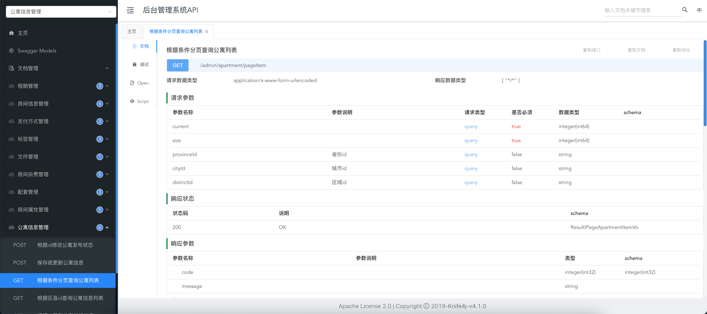

# Knife4j

## 概述

Knife4j是一个用于生成和展示API文档的工具，同时它还提供了在线调试的功能，下图是其工作界面。



- Knife4j有多个版本，最新版的Knife4j基于开源项目`springdoc-openapi`，这个开源项目的核心功能就是根据SpringBoot项目中的代码自动生成符合OpenAPI规范的接口信息。
- OpenAPI规范定义接口文档的内容和格式，其前身是`Swagger`规范。

## maven引入依赖

```xml
<dependency>
    <groupId>com.github.xiaoymin</groupId>
    <artifactId>knife4j-openapi3-jakarta-spring-boot-starter</artifactId>
    <version>4.3.0</version>
</dependency>
```

## 描述实体类

`@Schema`注解用于描述作为接口参数或者返回值的实体类的数据结构。

```java
@Data
@Schema(description = "用户信息实体")
public class User {

    @Schema(description = "编号")
    private Long id;

    @Schema(description = "用户姓名")
    private String name;

    @Schema(description = "用户年龄")
    private Integer age;

    @Schema(description = "用户邮箱")
    private String email;
}
```

## 描述Controller层

@Tag`注解用于对接口进行分类，相同`Tag`的接口会放在同一个菜单。

`@Operation`用于对接口进行描述。

`@Parameter`用于对HTTP请求参数进行描述

```java
@RestController
@RequestMapping("/user")
@Tag(name = "用户信息管理")
public class HelloController {


    @Operation(summary = "根据id获取用户信息")
    @GetMapping("getById")
    public User getUserById(@Parameter(description = "用户id") @RequestParam Long id) {
        User user = new User();
        user.setId(id);
        user.setName("zhangsan");
        user.setAge(11);
        user.setEmail("zhangsan@email.com");
        return user;
    }
}
```

## 创建配置类

1. `@Configuration`: 标记该类为Spring配置类。
2. `@OpenAPIDefinition`: 定义API的元数据。
3. `@Info`: 在`@OpenAPIDefinition`中指定API的基本信息。
4. `customOpenAPI()`方法: 创建并配置OpenAPI对象。
5. `components()`: 可以在这里添加全局组件。
6. `info()`: 配置API的详细信息。

```java
@Configuration
public class Knife4jConfiguration {

    @Bean
    public OpenAPI customOpenAPI() {

        return new OpenAPI().info(
                new Info()
                        .title("后台管理系统API")
                        .version("1.0")
                        .description("后台管理系统API"));
    }
    @Bean
    public GroupedOpenApi loginAPI() {

        return GroupedOpenApi.builder().group("后台登录管理").
                pathsToMatch(
                        "/admin/login/**",
                        "/admin/info"
                ).
                build();
    }
   
}
```

