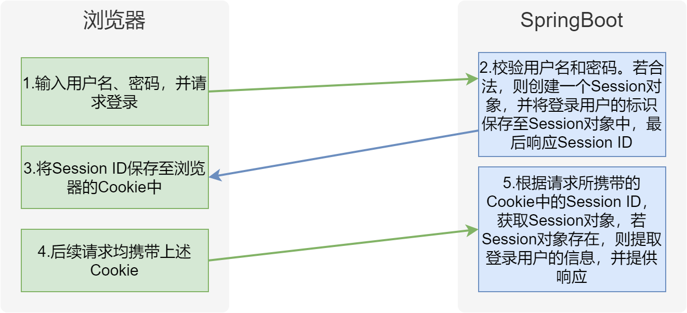

# SpringBoot 

## SpingBoot工程的创建

### 继承父工程依赖

```xml
<!--所有springboot项目都必须继承自 spring-boot-starter-parent-->
<parent>
    <groupId>org.springframework.boot</groupId>
    <artifactId>spring-boot-starter-parent</artifactId>
    <version>3.0.5</version>
</parent>
```

### 添加web启动类

```xml
<dependencies>
<!--web开发的场景启动器-->
    <dependency>
        <groupId>org.springframework.boot</groupId>
        <artifactId>spring-boot-starter-web</artifactId>
    </dependency>
</dependencies>
```

### 创建启动类

```java
package com.atguigu;

import org.springframework.boot.SpringApplication;
import org.springframework.boot.autoconfigure.SpringBootApplication;

/**
 * @SpringBootApplication是一个特殊的注解，用于标识一个Spring Boot应用程序的入口类。它的主要作用是将三个常用注解组合在一起，简化了配置的过程。
 *
 * 具体而言，@SpringBootApplication注解包含以下三个注解的功能：
 *     @Configuration：将该类标识为应用程序的配置类。它允许使用Java代码定义和配置Bean。
 *     @EnableAutoConfiguration：启用Spring Boot的自动配置机制。它根据项目的依赖项自动配置Spring应用程序的行为。自动配置根据类路径、注解和配置属性等条件来决定要使用的功能和配置。
 *     @ComponentScan：自动扫描并加载应用程序中的组件，如控制器、服务、存储库等。它默认扫描@SpringBootApplication注解所在类的包及其子包中的组件。
 *
 * 使用@SpringBootApplication注解，可以将上述三个注解的功能集中在一个注解上，简化了配置文件的编写和组件的加载和扫描过程。它是Spring Boot应用程序的入口点，标识了应用程序的主类，
 * 并告诉Spring Boot在启动时应如何配置和加载应用程序。
 */
@SpringBootApplication
public class MainApplication {

    //SpringApplication.run() 方法是启动 Spring Boot 应用程序的关键步骤。它创建应用程序上下文、
    // 自动配置应用程序、启动应用程序，并处理命令行参数，使应用程序能够运行和提供所需的功能
    public static void main(String[] args) {
        SpringApplication.run(MainApplication.class,args);
    }
}
```

### 创建Controller类

**注： IoC和DI注解需要在启动类的同包或者子包下方可生效！无需指定，约束俗称。**

### 添加打包插件

  > 在Spring Boot项目中添加`spring-boot-maven-plugin`插件是为了支持将项目打包成可执行的可运行jar包。如果不添加`spring-boot-maven-plugin`插件配置，使用常规的`java -jar`命令来运行打包后的Spring Boot项目是无法找到应用程序的入口点，因此导致无法运行。

```XML
<!--    SpringBoot应用打包插件-->
<build>
    <plugins>
        <plugin>
            <groupId>org.springframework.boot</groupId>
            <artifactId>spring-boot-maven-plugin</artifactId>
        </plugin>
    </plugins>
</build>
```

## Spring IOC容器和DI注入

### IOC

`@Component` 注解：将自己写的简单类放入IOC容器 Spring会自动检测并创建一个Bean

`@Bean` 注解： 将第三方的类或无法修改源码的情况下创建一个Bean

### DI注入

类上添加 `@Autowired` Spring会从ioc容器中自动寻找并注入类

```java
    @Autowired
    private AliyunSMSProperties properties;
```


## SpingBoot工程配置

### 统一配置管理

配置文件应该放置在Spring Boot工程的**src/main/resources**目录下。这是因为**src/main/resources**目录是Spring Boot默认的类路径（classpath），配置文件会被自动加载并可供应用程序访问。

**位置：resources文件夹下，必须命名application  后缀 .properties / .yaml /  .yml 。**

yml文件格式例：

```yml
server:
  port: 8080

spring:
  datasource:
    type: com.zaxxer.hikari.HikariDataSource
    url: jdbc:mysql://192.168.168.131:3306/lease?useUnicode=true&characterEncoding=utf-8&useSSL=false&allowPublicKeyRetrieval=true&serverTimezone=GMT%2b8
    username: root
    password: 123456
    hikari:
      connection-test-query: SELECT 1 # 自动检测连接
      connection-timeout: 60000 #数据库连接超时时间,默认30秒
      idle-timeout: 500000 #空闲连接存活最大时间，默认600000（10分钟）
      max-lifetime: 540000 #此属性控制池中连接的最长生命周期，值0表示无限生命周期，默认1800000即30分钟
      maximum-pool-size: 12 #连接池最大连接数，默认是10
      minimum-idle: 10 #最小空闲连接数量
      pool-name: SPHHikariPool # 连接池名称
  data:
    redis:
      host: 192.168.168.131
      port: 6379
      database: 1
```


### 批量配置注入

@ConfigurationProperties 注解 可以将一些配置属性批量注入到bean对象。

prefix属性配置前缀

```java
@ConfigurationProperties(prefix = "minio")
@Data
public class MinioProperties {

    private String endpoint;

    private String accessKey;

    private String secretKey;

    private String bucketName;
}
```

### MVC开发模式

#### Controller层

**`@Controller` 注解指定为controller层  `@RestController` 注解为`@Controller`和`@ResponseBody`的组合。它默认将方法的所有返回值序列化为JSON字符串**  

`@RequestMapping` 注解接收指定路径下的请求

例：

```java
@RequestMapping("/admin/file")
@RestController
public class FileUploadController {

    @Autowired
    private FileService fileService;

    @Operation(summary = "上传文件")
    @PostMapping("upload")
    public Result<String> upload(@RequestParam MultipartFile file) throws ServerException, InsufficientDataException, ErrorResponseException, IOException, NoSuchAlgorithmException, InvalidKeyException, InvalidResponseException, XmlParserException, InternalException {
        String url = fileService.upload(file);
        return Result.ok(url);
    }

}
```

#### Service层

**`@Service` 注解指定Service层**

```java
@Service
public class ApartmentFacilityServiceImpl extends ServiceImpl<ApartmentFacilityMapper, ApartmentFacility>
    implements ApartmentFacilityService{

}
```

#### Dao层

mapper类

```java
public interface ApartmentFacilityMapper extends BaseMapper<ApartmentFacility> {

}
```

**通过@Mapper注解指定mapper接口或**

**@Mapperscan注解指定mapper接口所在路径**

```java
@Configuration
@MapperScan("com.atguigu.lease.web.*.mapper")
public class MybatisPlusConfiguration {

}
```

mapper.xml文件

**通过`namespace` 指定mapper类路径**

```xml
<?xml version="1.0" encoding="UTF-8"?>
<!DOCTYPE mapper
        PUBLIC "-//mybatis.org//DTD Mapper 3.0//EN"
        "http://mybatis.org/dtd/mybatis-3-mapper.dtd">
<mapper namespace="com.atguigu.lease.web.admin.mapper.ApartmentFacilityMapper">

</mapper>
```

## 拦截器（登录拦截）

### 配置拦截器

- `preHandle()`方法是在请求处理之前调用,即在实际的处理器方法执行之前调用。
- `postHandle()`方法是在处理器方法执行之后调用,但视图还没有渲染之前调用。
- `afterCompletion()`方法是在整个请求处理完毕后调用,即视图渲染完成之后。

```java
@Component
public class MyInterceptor implements HandlerInterceptor {
    @Override
    public boolean preHandle(HttpServletRequest request, HttpServletResponse response, Object handler) throws Exception {
        System.out.println("MyInterceptor拦截器的preHandle方法执行....");
        return true;
    }

    @Override
    public void postHandle(HttpServletRequest request, HttpServletResponse response, Object handler, ModelAndView modelAndView) throws Exception {
        System.out.println("MyInterceptor拦截器的postHandle方法执行....");
    }

    @Override
    public void afterCompletion(HttpServletRequest request, HttpServletResponse response, Object handler, Exception ex) throws Exception {
        System.out.println("MyInterceptor拦截器的afterCompletion方法执行....");
    }
}
```

拦截器需要在**`WebMvcConfigurer`**注册方可执行

**`WebMvcConfigurer`配置类要在启动类的同包或者子包方可生效**

```
addPathPatterns //添加拦截路径
excludePathPatterns //排除拦截路径
```

```java
@Configuration
public class MvcConfig implements WebMvcConfigurer {

    @Autowired
    private MyInterceptor myInterceptor ;

    /**
     * /**  拦截当前目录及子目录下的所有路径 /user/**   /user/findAll  /user/order/findAll
     * /*   拦截当前目录下的以及子路径   /user/*     /user/findAll
     * @param registry
     */
    @Override
    public void addInterceptors(InterceptorRegistry registry) {
        registry.addInterceptor(myInterceptor).
        addPathPatterns("/**").
        excludePathPatterns("/admin/login/**");
    }
}
```

## SpringBoot声明式事务

  依赖导入:

```XML
 <dependency>
    <groupId>org.springframework.boot</groupId>
    <artifactId>spring-boot-starter-jdbc</artifactId>
</dependency>
```

  注：SpringBoot项目会自动配置一个 DataSourceTransactionManager，所以我们只需在方法（或者类）加上 @Transactional 注解，就自动纳入 Spring 的事务管理了

```Java
@Transactional
public void update(){
    User user = new User();
    user.setId(1);
    user.setPassword("test2");
    user.setAccount("test2");
    userMapper.update(user);
}
```

## AOP面向切面编程

### 引入依赖

```xml
<dependency>
    <groupId>org.springframework.boot</groupId>
    <artifactId>spring-boot-starter-aop</artifactId>
</dependency>
```

### 直接使用aop注解即可: 

`@Aspect` ：定义为AOP切面类

`@Before`  :定义为切面路径 切入点表达式

```Java
@Component
@Aspect
public class LogAdvice {

    @Before("execution(* com..service.*.*(..))")
    public void before(JoinPoint joinPoint){
        System.out.println("LogAdvice.before");
        System.out.println("joinPoint = " + joinPoint);
    }

}
```

## Spring自定义Converter类

枚举类型type字段在数据库、实体类、前后端交互的过程中有多种不同的形式，因此在请求和响应的过程中，**type**字段会涉及到多次类型转换。

**type**字段的各种形式：

- **数据库中**

  数据库中的**type**字段为`tinyint`类型

  ```
  +-------------+--------------+
  | Field       | Type         |
  +-------------+--------------+
  | id          | bigint       |
  | type        | tinyint      |
  | name        | varchar(255) |
  | create_time | timestamp    |
  | update_time | timestamp    |
  | is_deleted  | tinyint      |
  +-------------+--------------+
  ```

- **实体类**

  实体类中的**type**字段为`ItemType`枚举类型

  `LabelInfo`实体类如下

  ```java
  @Schema(description = "标签信息表")
  @TableName(value = "label_info")
  @Data
  public class LabelInfo extends BaseEntity {
  
      private static final long serialVersionUID = 1L;
  
      @Schema(description = "类型")
      @TableField(value = "type")
      private ItemType type;
  
      @Schema(description = "标签名称")
      @TableField(value = "name")
      private String name;
  }
  ```

  `ItemType`枚举类如下

  ```java
  public enum ItemType {
  
      APARTMENT(1, "公寓"),
      ROOM(2, "房间");
  
      private Integer code;
      private String name;
  
      ItemType(Integer code, String name) {
          this.code = code;
          this.name = name;
      }
  }
  ```

- **前后端交互中**

  前后端交互所传递的数据中**type**字段为**数字**（1/2）。

  

具体转换过程如下图所示：

- **请求流程**

  

  **说明**

  - SpringMVC中的`WebDataBinder`组件负责将HTTP的请求参数绑定到Controller方法的参数，并实现参数类型的转换。
  - Mybatis中的`TypeHandler`用于处理Java中的实体对象与数据库之间的数据类型转换。

- **响应流程**

  

  **说明**

  - SpringMVC中的`HTTPMessageConverter`组件负责将Controller方法的返回值（Java对象）转换为HTTP响应体中的JSON字符串，或者将请求体中的JSON字符串转换为Controller方法中的参数（Java对象），例如下一个接口**保存或更新标签信息**

  

下面介绍一下每个环节的类型转换原理

- **WebDataBinder枚举类型转换**

  `WebDataBinder`依赖于[`Converter`](https://docs.spring.io/spring-framework/reference/core/validation/convert.html)实现类型转换，若Controller方法声明的`@RequestParam`参数的类型不是`String`，`WebDataBinder`就会自动进行数据类型转换。**SpringMVC提供了常用类型的转换器，例如`String`到`Integer`、`String`到`Date`，`String`到`Boolean`等等，其中也包括`String`到枚举类型**，但是`String`到枚举类型的默认转换规则是根据实例名称（"APARTMENT"）转换为枚举对象实例（ItemType.APARTMENT）。**若想实现`code`属性到枚举对象实例的转换，需要自定义`Converter`**，示例代码如下，具体内容官方文档](https://docs.spring.io/spring-framework/reference/core/validation/convert.html#core-convert-Converter-API)。

  ```java
  @Component
  public class StringToItemTypeConverter implements Converter<String, ItemType> {
      @Override
      public ItemType convert(String code) {
  
          for (ItemType value : ItemType.values()) {
              if (value.getCode().equals(Integer.valueOf(code))) {
                  return value;
              }
          }
          throw new IllegalArgumentException("code非法");
      }
  }
  ```

  注册该类

  ```java
  @Configuration
  public class WebMvcConfiguration implements WebMvcConfigurer {
  
      @Autowired
      private StringToItemTypeConverter stringToItemTypeConverter;
  
      @Override
      public void addFormatters(FormatterRegistry registry) {
          registry.addConverter(this.stringToItemTypeConverter);
      }
  }
  ```

  但是我们有很多的枚举类型都需要考虑类型转换这个问题，按照上述思路，我们需要为每个枚举类型都定义一个Converter，并且每个Converter的转换逻辑都完全相同，针对这种情况，我们使用[`ConverterFactory`](https://docs.spring.io/spring-framework/reference/core/validation/convert.html#core-convert-ConverterFactory-SPI)接口更为合适，这个接口可以将同一个转换逻辑应用到一个接口的所有实现类，因此定义一个`BaseEnum`接口，然后另所有的枚举类都实现该接口，然后就可以自定义`ConverterFactory`，集中编写各枚举类的转换逻辑了。具体实现如下：

  定义一个基础枚举类接口，所有枚举类都实现该接口

  ```
  public interface BaseEnum {
      Integer getCode();
      String getName();
  }
  ```

  创建转换工厂

  ```java
  @Component
  public class StringToBaseEnumConverterFactory implements ConverterFactory<String, BaseEnum> {
      @Override
      public <T extends BaseEnum> Converter<String, T> getConverter(Class<T> targetType) {
          return new Converter<String, T>() {
              @Override
              public T convert(String source) {
  
                  for (T enumConstant : targetType.getEnumConstants()) {
                      if (enumConstant.getCode().equals(Integer.valueOf(source))) {
                          return enumConstant;
                      }
                  }
                  throw new IllegalArgumentException("非法的枚举值:" + source);
              }
          };
      }
  }
  ```

  注册工厂`ConverterFactory` 

  ```java
  @Configuration
  public class WebMvcConfiguration implements WebMvcConfigurer {
  
      @Autowired
      private StringToBaseEnumConverterFactory stringToBaseEnumConverterFactory;
  
      @Override
      public void addFormatters(FormatterRegistry registry) {
          registry.addConverterFactory(this.stringToBaseEnumConverterFactory);
      }
  }
  ```

  

## 登录流程

- **基于Session**

  基于Session的认证流程如下图所示

  

  该方案的特点

  - 登录用户信息保存在服务端内存中，若访问量增加，单台节点压力会较大
  - 随用户规模增大，若后台升级为集群，则需要解决集群中各服务器登录状态共享的问题。

- **基于Token**

  基于Token的认证流程如下图所示

  

  该方案的特点

  - 登录状态保存在客户端，服务器没有存储开销
  - 客户端发起的每个请求自身均携带登录状态，所以即使后台为集群，也不会面临登录状态共享的问题。

**Token详解**

基于Token的登录方案

我们所说的Token，通常指**JWT**（JSON Web TOKEN）。JWT是一种轻量级的安全传输方式，用于在两个实体之间传递信息，通常用于身份验证和信息传递。

JWT是一个字符串，如下图所示，该字符串由三部分组成，三部分由`.`分隔。三个部分分别被称为

- `header`（头部）
- `payload`（负载）
- `signature`（签名）


各部分的作用如下

- **Header（头部）**

  Header部分是由一个JSON对象经过`base64url`编码得到的，这个JSON对象用于保存JWT 的类型（`typ`）、签名算法（`alg`）等元信息，例如

  ```json
  {
    "alg": "HS256",
    "typ": "JWT"
  }
  ```

- **Payload（负载）**

  也称为 Claims（声明），也是由一个JSON对象经过`base64url`编码得到的，用于保存要传递的具体信息。JWT规范定义了7个官方字段，如下：

  - iss (issuer)：签发人
  - exp (expiration time)：过期时间
  - sub (subject)：主题
  - aud (audience)：受众
  - nbf (Not Before)：生效时间
  - iat (Issued At)：签发时间
  - jti (JWT ID)：编号

  除此之外，我们还可以自定义任何字段，例如

  ```json
  {
    "sub": "1234567890",
    "name": "John Doe",
    "iat": 1516239022
  }
  ```

- **Signature（签名）**

  由头部、负载和秘钥一起经过（header中指定的签名算法）计算得到的一个字符串，用于防止消息被篡改。


登录流程如下图所示


根据上述登录流程，可分析出，登录管理共需三个接口，分别是**获取图形验证码**、**登录**、**获取登录用户个人信息**，除此之外，我们还需为所有受保护的接口增加验证JWT合法性的逻辑，这一功能可通过`HandlerInterceptor`来实现。

### 创建JWT工具类

```java
public class JwtUtil {
    private static long tokenExpiration = 60 * 60 * 1000 * 24 * 7L;
    private static SecretKey tokenSignKey = Keys.hmacShaKeyFor("M0PKKI6pYGVWWfDZw9hi87a0lTpGYX1d4AQ".getBytes());

    public static String createToken(Long userId, String username) {
        String token = Jwts.builder().
                setSubject("USER_INFO").
                setExpiration(new Date(System.currentTimeMillis() + tokenExpiration)).
                claim("userId", userId).
                claim("username", username).
                signWith(tokenSignKey).
                compact();
        return token;
    }
    public static Claims parseToken(String token) {
        if(token == null) {
            throw  new LeaseException(ResultCodeEnum.ADMIN_LOGIN_AUTH);
        }
        try{
            JwtParser jwtParser = Jwts.parserBuilder().setSigningKey(tokenSignKey).build();
            return jwtParser.parseClaimsJws(token).getBody();
        }catch (ExpiredJwtException e) {
            throw new LeaseException(ResultCodeEnum.TOKEN_EXPIRED);
        }catch (JwtException e) {
            throw new LeaseException(ResultCodeEnum.TOKEN_INVALID);
        }
    }
```

`createToken` 根据 userId 和 username 创建`token`

`parseToken` 解析验证token 并将登录用户信息保存至 `ThreadLocal` 方便在流程中查看

**ThreadLocal概述**

ThreadLocal的主要作用是为每个使用它的线程提供一个独立的变量副本，使每个线程都可以操作自己的变量，而不会互相干扰，其用法如下图所示。


### 创建LoginUserHolder类

```java
public class LoginUserHolder {
    public static ThreadLocal<LoginUser> threadLocal = new ThreadLocal<>();

    public static void setLoginUser(LoginUser loginUser) {
        threadLocal.set(loginUser);
    }

    public static LoginUser getLoginUser() {
        return threadLocal.get();
    }

    public static void clear() {
        threadLocal.remove();
    }
}
```

### 创建LoginUser类

`@AllArgsConstructor` 为每一个字段生成一个带参数的构造函数

```java
@Data
@AllArgsConstructor
public class LoginUser {

    private Long userId;
    private String username;
}
```

### 修改拦截器 

注： 在拦截器执行之后需清除`LoginUserHolder`中数据以免造成混乱

```java
@Component
public class AuthenticationInterceptor implements HandlerInterceptor {

    @Override
    public boolean preHandle(HttpServletRequest request, HttpServletResponse response, Object handler) throws Exception {

        String token = request.getHeader("access-token");

        Claims claims = JwtUtil.parseToken(token); //检查token
        Long userId = claims.get("userId", Long.class);
        String username = claims.get("username", String.class);
        LoginUserHolder.setLoginUser(new LoginUser(userId, username));

        return true;

    }

    @Override
    public void afterCompletion(HttpServletRequest request, HttpServletResponse response, Object handler, Exception ex) throws Exception {
        LoginUserHolder.clear();
    }
}
```

