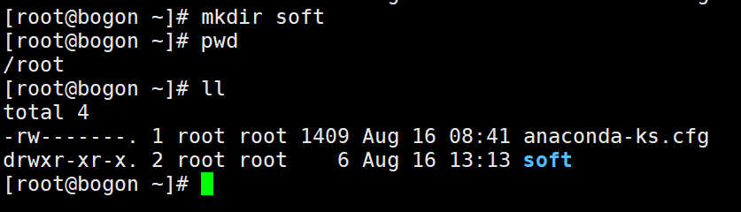
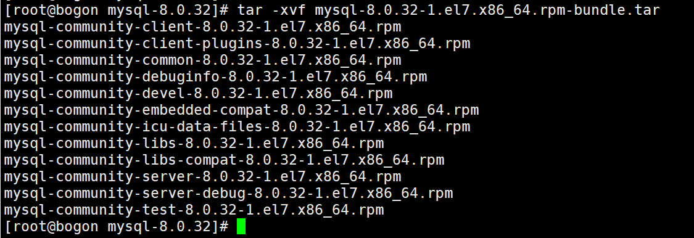

# Mysql

## Linux Centos 安装Mysql

### 下载

MySQL官网：[https://www.mysql.com/](https://www.mysql.com/)


#### 点击download


点击 "[MySQL Community (GPL) Downloads »](https://dev.mysql.com/downloads/)"

#### 在 "MySQL Communiy Downloads"


点击 " MySQL Community Server "

#### 进入"MySQL Community Server" 下载页面


点击 “Archives”按钮

#### 进入“MySQL Product Archives”页面


选择版本号和操作系统

选择指定版本：mysql-<相应版本编号>.rpm-bundle.tar 下载

### 安装

#### 创建soft文件夹

命令：mkdir soft



#### 将MySQL安装包上传到soft文件夹

可使用rz命令
也可使用xftp工具连接上传


#### 查看mariadb安装包

命令：rpm -qa | grep mariadb


#### 卸载mariadb

命令：rpm -e mariadb-libs-5.5.68-1.el7.x86_64 --nodeps


再次查看mariadb安装包

#### 在/usr/local目录下创建mysql目录

命令：cd /usr/local
命令：mkdir mysql-8.0.32


#### 把mysql安装包移动到mysql目录下

在soft目录下
命令：mv mysql-8.0.32-1.el7.x86_64.rpm-bundle.tar /usr/local/mysql-8.0.32/


#### 打开mysql目录


#### 解压MySQL安装包到/usr/local/mysql-8.0.32目录下

命令：tar -xvf mysql-8.0.32-1.el7.x86_64.rpm-bundle.tar



#### 安装MySQL其它安装包

命令：
rpm -ivh mysql-community-common-8.0.32-1.el7.x86_64.rpm --nodeps --force
rpm -ivh mysql-community-libs-8.0.32-1.el7.x86_64.rpm --nodeps --force
rpm -ivh mysql-community-client-8.0.32-1.el7.x86_64.rpm --nodeps --force
rpm -ivh mysql-community-server-8.0.32-1.el7.x86_64.rpm --nodeps --force


#### 查看MySQL其它安装包

命令：rpm -qa | grep mysql 


#### 初始化数据库

在mysql-8.0.32目录下，命令：mysqld --initialize


#### 修改mysql权限

在mysql-8.0.32目录下，命令：chown mysql:mysql /var/lib/mysql -R


#### 启动MySQL数据库服务

在mysql-8.0.32目录下，命令：systemctl start mysqld.service


#### 设置开机自启动MySQL服务

在mysql-8.0.32目录下，命令：systemctl enable mysqld

#### 查看安装MySQL初始化密码

命令：cat /var/log/mysqld.log | grep password


#### 进入MySQL数据库登录页面

在mysql-8.0.32目录下，命令：mysql -uroot -p
**注意：MySQL登录密码是不显示的 **


#### 执行SQL语句：show databases;

第一次使用将会提示修改mysql的root用户密码


#### 修改MySQL密码

命令：alter user 'root'@'localhost' identified by '123456';


#### 授权远程访问MySQL服务

在 MySQL 8.0.32 版本中，如果您想要为 'root' 用户设置密码并使用 mysql_native_password 身份验证插件，可以使用以下语句：
create user 'root'@'%' identified with mysql_native_password by '**root**';
请注意，这里的密码是** 'root'**，您可以根据需要更改密码。

**注意：修改远程访问密码**
**alter user 'root'@'%' identified with mysql_native_password by '123456';**

---

使用以下语句授予给 'root' 用户在 MySQL 8.0.32 中的所有权限，并使用 WITH GRANT OPTION 选项允许用户对其他用户进行授权：
grant all privileges on *.* to 'root'@'%' with grant option;
这将授予 'root' 用户在所有数据库和所有表上的所有权限，并具有对其他用户进行授权的能力。


#### 修改加密方式

原因：MySQL8.0 版本 和 5.0 的加密规则不一样，而现在的可视化工具只支持旧的加密方式。
命令：ALTER USER 'root'@'localhost' IDENTIFIED BY '123456' PASSWORD EXPIRE NEVER; 


#### 刷新权限

命令：flush privileges;


#### 退出MySQL

命令：exit;


#### 关闭防火墙firewall

systemctl stop firewalld.service;
systemctl disable firewalld.service;
systemctl mask firewalld.service;


## SQL相关语句注意事项

### 创建表

**column1**： 字段名

**datatype**： 字段类型

**constraint**： 约束

```mysql
CREATE TABLE table_name (
    column1 datatype [constraint], "备注"
    column2 datatype [constraint], "备注"
    ...
);
```

|   约束   |                           描述                           |   关键字    |
| :------: | :------------------------------------------------------: | :---------: |
| 主键约束 |         主键是一行数据的唯一标识，要求非空且唯一         | PRIMARY KEY |
| 非空约束 |                限制该字段的数据不能为null                |  NOT NULL   |
| 唯一约束 |     保证该字段的所有数据都是唯一、不重复的、可以为空     |   UNIQUE    |
| 默认约束 |      保存数据时，如果未指定该字段的值，则采用默认值      |   DEFAULT   |
| 检查约束 |   插入数值时根据指定条件校验合法性(8.0.16版本之后开始)   |    CHECK    |
| 外键约束 | 用来让两张表的数据之间建立连接，保证数据的一致性和完整性 | FOREIGN KEY |

### 多表查询

**例：**

```mysql
select k.id ak_id,
               k.name attr_key_name,
               v.id,
               v.name,
               v.attr_key_id
        from attr_key k
                 left join attr_value v
                           on k.id = v.attr_key_id
                               and v.is_deleted = 0
        where k.is_deleted = 0
```

注：左连接需带上右表的 is_deleted字段 确保返回左表所有字段


### 事务

```mysql
SET @@autocommit = 0; # 设置为手动提交事务
SET @@autocommit = 1; # 设置为自动提交事务
```


```mysql
#开启事务
START TRANSACTION; 或 BEGIN;
#sql语句
#提交事务
commit;
```

