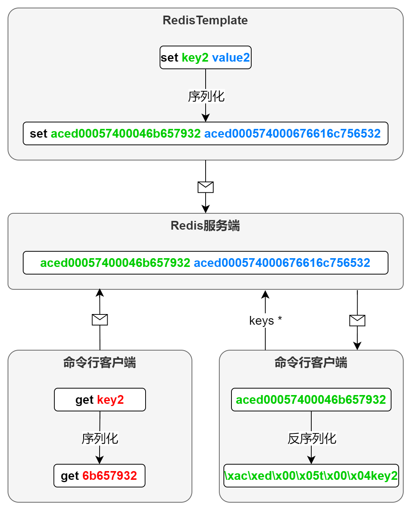

# Redis

## Linux Centos 安装 Redis

### 上传


### 解压

命令：tar -zxvf redis-7.0.11.tar.gz -C /usr/local/


### make编译命令（redis根目录中执行）

注：gcc和cc是c语言和c++编译的一个命令
make命令执行过程中可能报错，根据控制台输出的错误信息进行解决
	错误一：gcc命令找不到，是由于没有安装gcc编译器导致。
	错误二： error: jemalloc/jemalloc.h: No such file or directory


1. 错误一解决方法：安装gcc

命令：yum -y install gcc
gcc是GNU compiler collection的缩写，它是Linux下一个编译器集合，是c或c++程序的编译器。


2. 错误二解决方法：执行 make MALLOC=libc

内存分配器使用libc，执行 make MALLOC=libc，由于.h是c语言的头文件，没有找到该头文件，使用libc内存分配器找到该头文件，使用它来代替，这样就可以解决该问题。

3. 执行make distclean清理一下上次make后产生的文件，再执行make

### make install【可选操作】

有人在make执行之后再执行 make install，该操作则将 src下的许多可执行文件复制到/usr/local/bin 目录下，也就是path路径下，这样的话就可以在任意目录执行这些命令。不然需要切换到这些命令目录才可执行。（可以不用执行，但你也可以执行，我一般不执行）

### 修改配置文件


1. 注释掉  bind 127.0.0.1 -::1


2. 修改端口号为：6380，默认为：6379


3. 设置访问密码为：123456，默认没有密码


### 启动

在/usr/local/redis-7.0.11/src下启动redis服务


## Reids概述

**1.Redis定义**

Redis（Remote Dictionary Server）是一个**基于内存**的键值对存储系统，常用作缓存服务。由于Reids将数据都保存在内存中，因此其读写性能十分惊人，同时，为保证数据的可靠性，Redis会将数据备份到硬盘上，用于故障发生时的数据恢复。

2.**Redis特点**

- 高性能 ：Redis主要将数据存储在内存中，因此读写速度非常快，适合对速度有较高要求的场景
- 支持多种数据结构
- 持久化 ：Redis可以通过**定期快照**或者**实时记录写操作日志**的方式将内存中的数据持久化到硬盘，确保数据在重启后不会丢失。
- 灵活的数据过期策略： 可以为每个键设置过期时间，一旦过期，Redis会自动删除。

**3.应用场景** 

用作**缓存**，缓存可以显著提升访问速度，降低数据库压力


## SpringBoot整合Redis

**Spring Data Redis** 是Spring大家族中的一个子项目，主要用于Spring程序和Redis的交互。它基于的Redis Java客户端（[Jedis](https://github.com/redis/jedis)和[Lettuce](https://lettuce.io/)）做了抽象，提供了一个统一的编程模型，使得Spring程序与Redis的交互变得十分简单。

**Spring Data Redis** 中有一个十分重要的类——`RedisTemplate`，它封装了与Redis进行的交互的各种方法，我们主要用使用它与Redis进行交互。


**引入依赖**

```xml
<dependency>
    <groupId>org.springframework.boot</groupId>
    <artifactId>spring-boot-starter-data-redis</artifactId>
</dependency>
```

配置**yml**

```yml
spring:
  data:
    redis:
      host: <ip:端口>
      port: 6379
      database: 0
```

根据Redis的数据类型，RedisTemplate对各种交互方法做了分组，以下是常用的几个分组

| 分组                          | 说明                 |
| :---------------------------- | :------------------- |
| `redisTemplate.opsForValue()` | 操作string类型的方法 |
| `redisTemplate.opsForList()`  | 操作list类型的方法   |
| `redisTemplate.opsForSet()`   | 操作set类型的方法    |
| `redisTemplate.opsForHash()`  | 操作hash类型的方法   |
| `redisTemplate.opsForZSet()`  | 操作zset类型的方法   |
| `redisTemplate`               | 通用方法             |

### redisTemplate序列化问题

1. - **问题演示**

     - **问题一**

       使用RedisTemplate向Redis中增加一个键值对

       ```java
       redisTemplate.opsForValue().set("key2","value2");
       ```

       使用RedisTemplate查询key2所对应的value，有结果

       ```java
       redisTemplate.opsForValue().get("key2");
       ```

       使用命令行客户端查询key2所对应的value，无结果

       ```
       get key2
       ```

     - **问题二**

       在图形化客户端或者命令行客户端观察key2，显示异常

       RedisInsight中的key2显示如下

       

       命令行客户端中的key2显示如下

       

   - **问题说明**

     上述问题的根本原因是，Redis中的key和value均是以二进制的形式存储的，因此客户端输入的key和value都会经过序列化之后才发往Redis服务端。而RedisTemplate所使用序列化方式和命令行客户端采用序列化方式不相同，进而导致序列化之后的二进制数据不同，所以才会导致上述的现象。

     

2. **StringRedisTemplate使用**

   为解决上述问题，可使用`StringRedisTemplate`代替`RedisTemplate`，因为`StringRedisTemplate`使用的序列化器和命令行所使用的序列化器是相同的。

   `spring-boot-starter-data-redis`同样提供了`StringRedisTemplate`的自动配置，因此我们也可以直接将其注入到自己的类中。实例代码如下

   ```java
   @SpringBootTest
   public class TestStringRedisTemplate {
   
       @Autowired
       private StringRedisTemplate redisTemplate;
   
       @Test
       public void testSet() {
           redisTemplate.opsForValue().set("key4", "value4");
       }
   
       @Test
       public void testGet() {
           String result = redisTemplate.opsForValue().get("key4");
           System.out.println(result);
       }
   
       @Test
       public void testDel() {
           redisTemplate.delete("key4");
       }
   }
   ```


## Redis缓存逻辑

`Spring-data-redis`提供了`StringRedisTemplate`和`RedisTemplate<Object,Object>`两个实例，当俩个实例均不满足时， 需自定义RedisTemplate

例：

```java
@Configuration
public class RedisConfiguration {

    @Bean
    public RedisTemplate<String, Object> stringObjectRedisTemplate(RedisConnectionFactory redisConnectionFactory) {
        RedisTemplate<String, Object> template = new RedisTemplate<>();
        template.setConnectionFactory(redisConnectionFactory);
        template.setKeySerializer(RedisSerializer.string());
        template.setValueSerializer(RedisSerializer.java());
        return template;
    }
}
```

